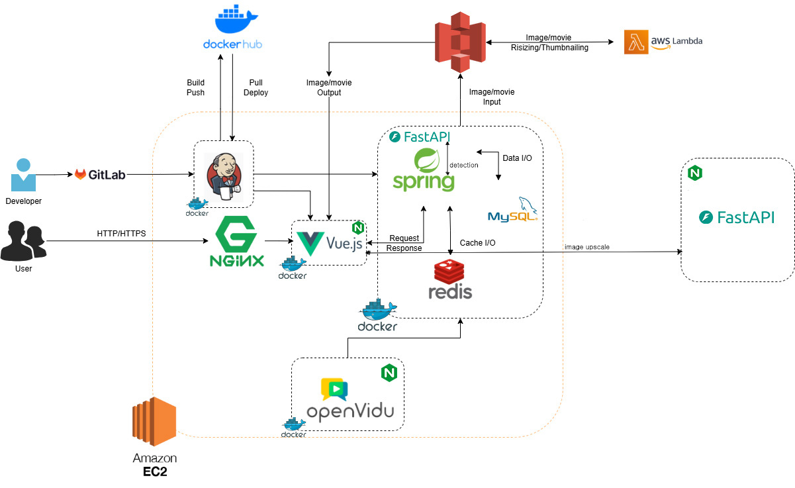
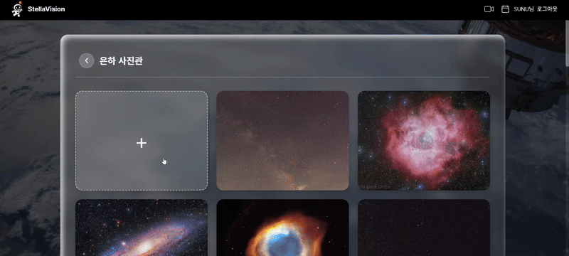
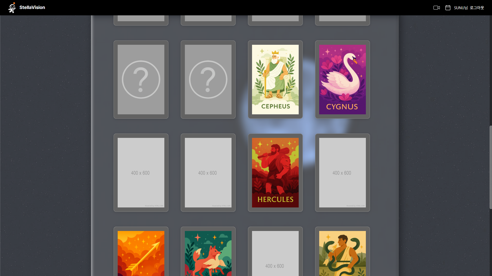
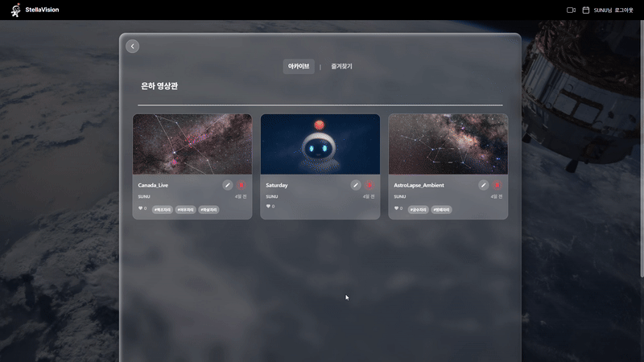
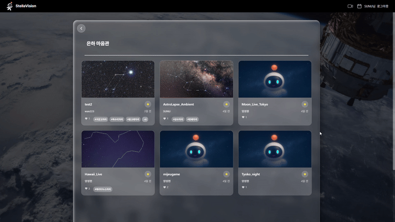
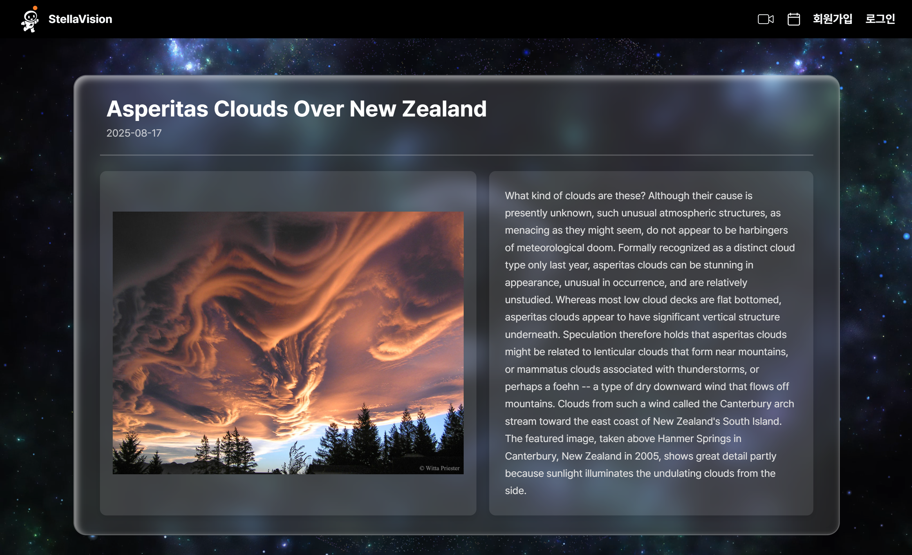
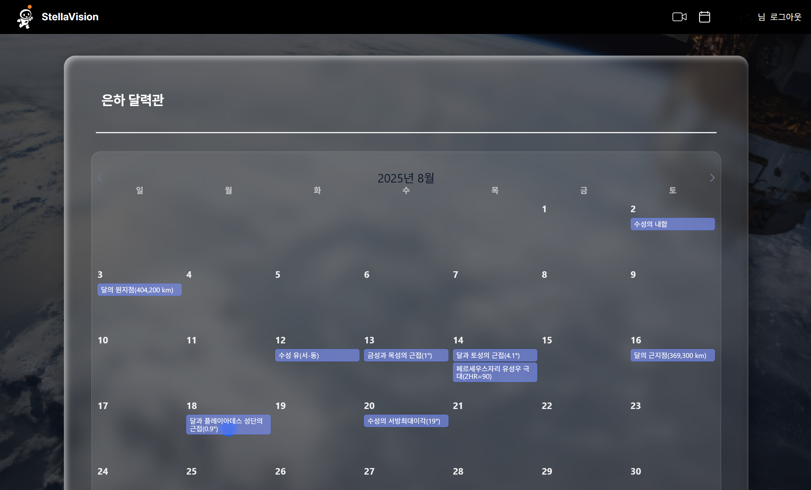

# StellarVision
🏆 SSAFY 13기 공통 프로젝트 - StellarVision: 사람과 하늘을 잇는 천체 스트리밍 별자리 태깅 서비스

---

## 프로젝트 소개
밤하늘의 별을 집에서 편하게 보면서, 그 별자리의 이름까지 알 수 있다면 얼마나 좋을까요?  

현대 사회에서 빛공해, 구름 등으로 인해 천체 관측이 어려운 상황,  
별자리를 구분하기 힘든 답답함을 **StellarVision**이 해결해드립니다.

StellarVision과 함께라면, 밤하늘을 더 정확하고 편리하게 즐길 수 있습니다.

---

## 프로젝트 기간
📅 2025.07.07 ~ 2025.08.18 (7주)

---

## 주요 기능
- **실시간 천체 스트리밍**
  - OpenVidu 기반 실시간 별자리 스트리밍
  - AI 버튼 토글로 별자리 이름 확인
  - 캡처 후 업스케일링 이미지 다운로드
  - 실시간 채팅 기능

- **사진 업로드**
  - 업로드 시 AI가 별자리 자동 태깅

- **다시보기**
  - 스트리밍 영상 자동 저장 및 별자리 태깅
  - 좋아요 기능으로 영상 보관

- **도감**
  - 별자리 수집 시 뱃지 획득
  - 프로필에 뱃지 장착 가능

- **오늘의 천체 사진**
  - 매일 새로운 천체 사진 및 정보 제공

- **올해의 천체 일정**
  - 특별한 연월일식 일정 확인 가능

---

## 기술 스택

### Backend
- Spring Boot (REST API, WebSocket)
- MySQL
- OpenVidu (실시간 스트리밍)
- Jenkins, Docker, Nginx, S3 (배포)

### Frontend
- Vue 3 (SPA)
- Tailwind CSS
- WebRTC

### AI & Image
- Astrometry (별자리 라벨링)
- YOLO 모델 (이미지 학습)
- Real-ESRGAN (화질 개선)

### 협업 도구
- Git / GitLab Projects
- Jira
- Figma
- Notion

---

## 아키텍처
<p align="center">
  
</p>

---

## 프로젝트 산출물
- [기능명세서](./docs/기능명세서.md)  
- [API명세서](./docs/API명세서.md)  
- [ERD](./docs/ERD.md)  

---

## 폴더 구조

### Back-end
<details>
<summary>펼쳐보기</summary>

```plantext
StellarVision.
  ├───java
  │   └───com
  │   └───susang
  │   └───stellaVision
  │   ├───application
  │   │   ├───auth
  │   │   │    ├───email
  │   │   │    jwt
  │   │   ├───collection
  │   │   │    ├───controller
  │   │   │    ├───error
  │   │   │    ├───dto
  │   │   │    ├───repository
  │   │   │    └───service
  │   │   ├───follow
  │   │   │    ├───controller
  │   │   │    ├───exception
  │   │   │    ├───dto
  │   │   │    ├───repository
  │   │   │    └───service
  │   │   ├───member
  │   │   │    ├───controller
  │   │   │    ├───exception
  │   │   │    ├───dto
  │   │   │    ├───repository
  │   │   │    └───service
  │   │   ├───photo
  │   │   │    ├───controller
  │   │   │    ├───dto
  │   │   │    ├───error
  │   │   │    ├───repository
  │   │   │    └───service
  │   │   ├───profile
  │   │   │    ├───controller
  │   │   │    ├───dto
  │   │   │    ├───error
  │   │   │    └───service
  │   │   ├───streaming
  │   │   │    ├───controller
  │   │   │    ├───dto
  │   │   │    ├───exception
  │   │   │    ├───repository
  │   │   │    └───service
  │   │   └───video
  │   │        ├───controller
  │   │        ├───error
  │   │        ├───dto
  │   │        ├───repository
  │   │        └───service
  │   ├───common
  │   │   ├───constants
  │   │   ├───dto
  │   │   ├───exception
  │   │   ├───redis
  │   │   ├───s3
  │   │   ├───security
  │   │   └───utils
  │   └───config
  └───entity
  ```
</details>

### Front-end
<details>
<summary>펼쳐보기</summary>

```plantext
StellarVision.
src/
├─ App.vue             # 메인 Vue 컴포넌트
├─ main.js             # 진입점
├─ api/                # 서버 통신 모듈
│   ├─ axiosApi.js
│   ├─ calenderApi.js
│   ├─ commonApi.js
│   ├─ streamingApi.js
│   └─ todayPhotoApi.js
├─ assets/             # 스타일, 폰트, 이미지
│   ├─ base.css
│   ├─ components.scss
│   ├─ layout.scss
│   ├─ main.css
│   ├─ font/
│   └─ pictures/
├─ components/         # 재사용 UI 컴포넌트
│   ├─ auth/           # 로그인 관련
│   ├─ badge/          # 뱃지 관련
│   ├─ comment/        # 채팅/댓글
│   ├─ common/         # 공통 UI
│   ├─ landing/        # 랜딩 페이지
│   ├─ main/           # 메인 페이지
│   ├─ streaming/      # 스트리밍 관련
│   └─ video/          # 영상 관련
├─ composables/        # 재사용 Composition API
├─ constants/          # 상수 정의
├─ data/               # 초기/더미 데이터
├─ router/             # Vue Router 설정
├─ services/           # 비즈니스 로직
├─ stores/             # 상태 관리 (Pinia/Vuex)
└─ views/              # 페이지 단위 컴포넌트

.env                   # 환경 변수
.gitignore             # Git 무시 파일
```
</details>

<br/>

---

## 팀원 소개
| <div align="center"><br>방준엽<br>Back End</div> | <div align="center"><br>구인완<br>Back End</div> | <div align="center"><br>양정현<br>AI</div> | <div align="center"><br>김선우<br>Front End</div> | <div align="center"><br>임정원<br>Front End</div> | <div align="center"><br>신성규<br>Front End</div> |
|:---------------------------------------:|:---------------------------------------:|:---------------------------------------:|:---------------------------------------:|:---------------------------------------:|:---------------------------------------:|


---

## 프로젝트 결과물
- [최종발표자료](./docs/StellarVision_최종발표_PPT.pptx)  
- [영상포트폴리오](./docs/영상포트폴리오_.mp4)  

---

## 화면 구성

### 랜딩페이지


### 프로필
- **은하 사진관** : 업로드 시 AI 별자리 태깅 및 뱃지 획득  
  

- **은하 수집관** : 획득한 별자리 도감 조회  
  

- **은하 영상관** : 스트리밍 저장, AI 태깅 및 썸네일 설정  
  

- **은하 마음관** : 좋아요 목록 관리  
  

### 은하 천체관
- 오늘의 천체 사진 제공  
  

### 은하 달력관
- 특별한 연월일식 일정 확인  
  

### 스트리밍
- 실시간 별자리 탐지 및 채팅 지원  
- 캡쳐 업스케일링 다운로드 제공  

---

## 시연 영상
👉 [시청하기](https://youtu.be/cChNDY36zZ4)
