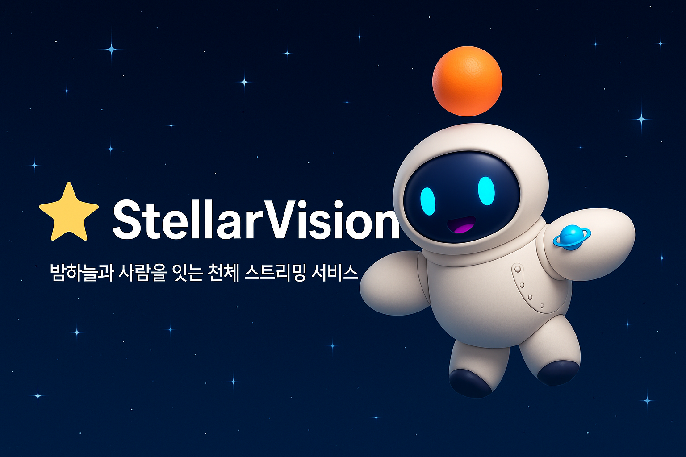
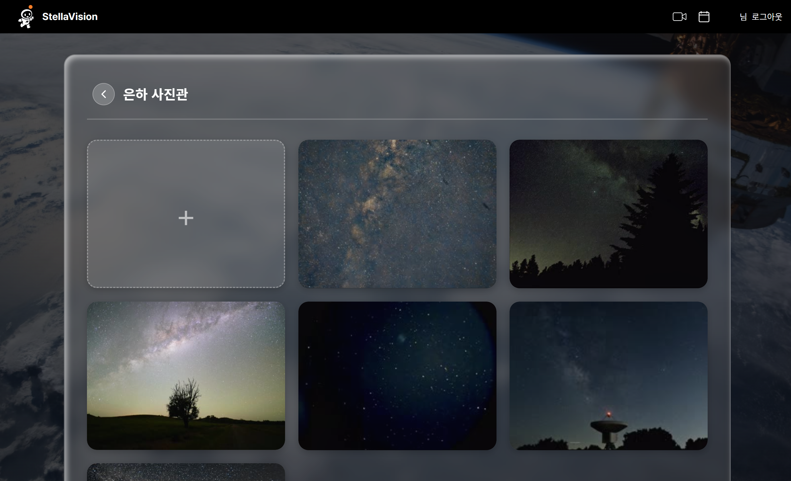
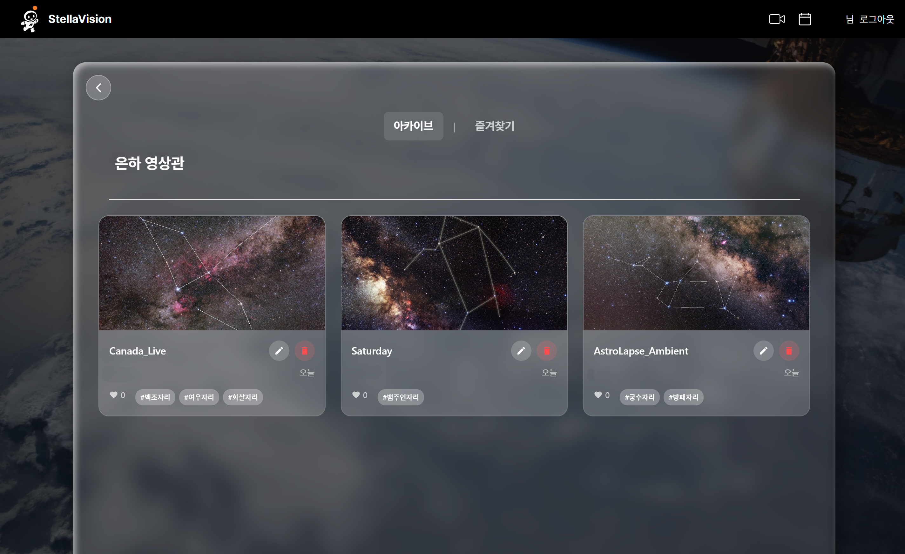
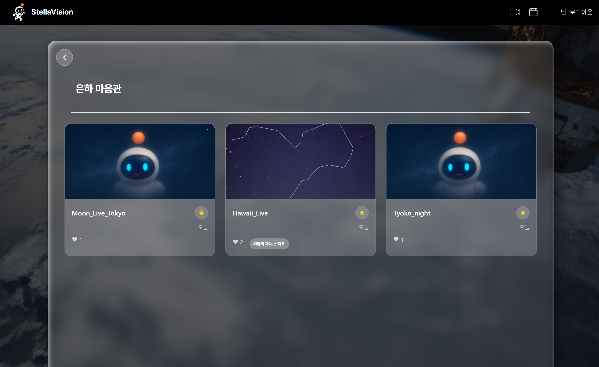
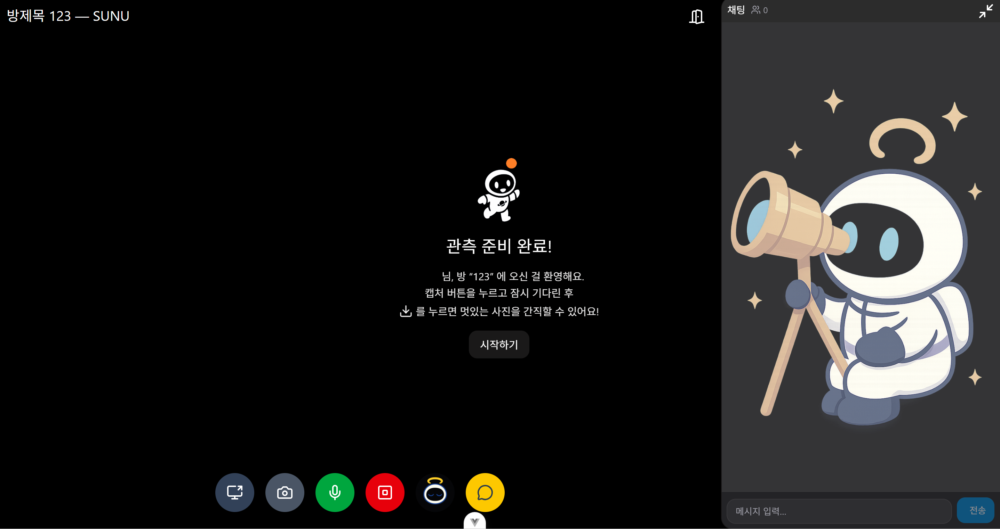

# 🪐 StellarVision



## ⭐ 프로젝트 소개
밤하늘의 별을 집에서 **편하게** 보면서, 그 **별자리의 이름**까지 알 수 있는 서비스가 있다면 얼마나 좋을까요? <br/>

현대 사회에서 빛공해, 구름 등으로 인한 힘든 천체 구경, 어떻게 해결할 수 있을까요? <br/> 천체의 별자리를 구분하기 어려워 답답하시지 않나요? <br/>

이제 StellarVision으로 그 불편함을 해소해보세요! <br/>StellarVision과 함께하면 밤하늘을 더 정확하고 편하게 볼 수 있습니다😄

<br/>

## ⭐ 프로젝트 기간
2025.07.07 ~ 2025.08.18 (7주)

<br/>

## ⭐ 주요 기능
- **실시간 천체 스트리밍 서비스**
  - openVidu로 실시간 별자리 스트리밍 서비스
  - 스트리밍 중 AI 버튼을 토글하여 별자리 이름 확인 가능
  - 화면 캡쳐 후 업스케일링 사진 다운로드 
  - 채팅을 통한 스트리머와의 실시간 소통

- **사진 업로드 기능**
  - 별자리 사진을 업로드 하면, AI가 해당 사진을 인식하여 별자리 이름을 태깅

- **다시보기 기능**
  - 실시간 스트리밍 영상 저장 및 탐지된 별자리 자동 태깅
  - 좋아요 기능을 통해 좋아하는 영상 저장
  
- **도감**
  - 사진 업로드 시 도감에 해당하는 별자리일 경우 뱃지 획득 
  - 본인 프로필에 뱃지 장착 가능

- **오늘의 천체 사진**
  - 매일 오늘의 천체 사진과 그 정보 확인 가능
  
- **올해의 천체 일정**
  - 올해의 특별한 연월일식 일정 확인 가능 

<br/>

## ⭐ 기술 스택

### ⚙️ Backend
- **Spring Boot** (REST API, WebSocket 지원)
- **MySQL** (데이터베이스 관리)
- **OpenVidu** (실시간 화상/스트리밍)
- **Jenkins, Docker, Nginx / S3** (배포 및 이미지 저장)

### 💻 Frontend
- **VUE3** (SPA 구현)
- **Tailwind CSS** (스타일링)
- **WebRTC** (실시간 스트리밍 연동)

### 🤖 AI & Image
- **Astrometry** (별자리 라벨링)
- **YOLO 모델** (이미지 학습)
- **Real-ESRGAN** (화질 개선)

### 🛠 협업 & 기타
- **Git / GitLab Projects** (버전 관리 및 이슈 관리)
- **Jira** (프로젝트 일정 관리)
- **Figma** (UI/UX 디자인)
- **Notion** (문서 관리)

<br/>

## ⭐ 아키텍처


## 💛 프로젝트 산출물

- [기능명세서](./docs/기능명세서.md)
- [API명세서](./docs/API명세서.md)
- [ERD](./docs/ERD.md)

<br/>

## ⭐ 프로젝트 폴더 구조
### Back-end
<details>
<summary>펼쳐보기</summary>

```plantext
StellarVision.
  ├───java
  │   └───com
  │   └───ssafy
  │   └───kidslink
  │   ├───application
  │   │   ├───auth
  │   │   │    ├───email
  │   │   │    jwt
  │   │   ├───collection
  │   │   │    ├───controller
  │   │   │    ├───error
  │   │   │    ├───dto
  │   │   │    ├───repository
  │   │   │    └───service
  │   │   ├───follow
  │   │   │    ├───controller
  │   │   │    ├───exception
  │   │   │    ├───dto
  │   │   │    ├───repository
  │   │   │    └───service
  │   │   ├───member
  │   │   │    ├───controller
  │   │   │    ├───exception
  │   │   │    ├───dto
  │   │   │    ├───repository
  │   │   │    └───service
  │   │   ├───photo
  │   │   │    ├───controller
  │   │   │    ├───dto
  │   │   │    ├───error
  │   │   │    ├───repository
  │   │   │    └───service
  │   │   ├───profile
  │   │   │    ├───controller
  │   │   │    ├───dto
  │   │   │    ├───error
  │   │   │    └───service
  │   │   ├───streaming
  │   │   │    ├───controller
  │   │   │    ├───dto
  │   │   │    ├───exception
  │   │   │    ├───repository
  │   │   │    └───service
  │   │   └───video
  │   │        ├───controller
  │   │        ├───error
  │   │        ├───dto
  │   │        ├───repository
  │   │        └───service
  │   ├───common
  │   │   ├───constants
  │   │   ├───dto
  │   │   ├───exception
  │   │   ├───redis
  │   │   ├───s3
  │   │   ├───security
  │   │   └───utils
  │   └───config
  └───entity
  ```
</details>

### Front-end
<details>
<summary>펼쳐보기</summary>

```plantext
StellarVision.
src/
├─ App.vue             # 메인 Vue 컴포넌트
├─ main.js             # 진입점
├─ api/                # 서버 통신 모듈
│   ├─ axiosApi.js
│   ├─ calenderApi.js
│   ├─ commonApi.js
│   ├─ streamingApi.js
│   └─ todayPhotoApi.js
├─ assets/             # 스타일, 폰트, 이미지
│   ├─ base.css
│   ├─ components.scss
│   ├─ layout.scss
│   ├─ main.css
│   ├─ font/
│   └─ pictures/
├─ components/         # 재사용 UI 컴포넌트
│   ├─ auth/           # 로그인 관련
│   ├─ badge/          # 뱃지 관련
│   ├─ comment/        # 채팅/댓글
│   ├─ common/         # 공통 UI
│   ├─ landing/        # 랜딩 페이지
│   ├─ main/           # 메인 페이지
│   ├─ streaming/      # 스트리밍 관련
│   └─ video/          # 영상 관련
├─ composables/        # 재사용 Composition API
├─ constants/          # 상수 정의
├─ data/               # 초기/더미 데이터
├─ router/             # Vue Router 설정
├─ services/           # 비즈니스 로직
├─ stores/             # 상태 관리 (Pinia/Vuex)
└─ views/              # 페이지 단위 컴포넌트

.env                   # 환경 변수
.gitignore             # Git 무시 파일
```
</details>

<br/>

## ⭐ 팀원 소개
|  |  |  |  |  |  |
|------------------------------------------|------------------------------------------|------------------------------------------|------------------------------------------|------------------------------------------|------------------------------------------|
| Back End                         | Back End                                  | AI                                       | Front End                                | Front End                                | Front End                                |


<br/>

## ⭐ 프로젝트 결과물
- [최종발표자료](./docs/StellarVision_최종발표_PPT.pptx)
- [영상포트폴리오](./docs/영상포트폴리오_.mp4)

<br/>

## ⭐ 화면 구성

### 랜딩페이지


### 프로필
- 개인 갤러리 및 다시보기 영상 관리
- 뱃지 도감 컬렉팅 및 전시 관리
- 별자리 도감 획득 및 조회  








### 스트리밍


### 은하 천체관


### 은하 달력관
- 올해의 특별 연월일식 일정 조회  


